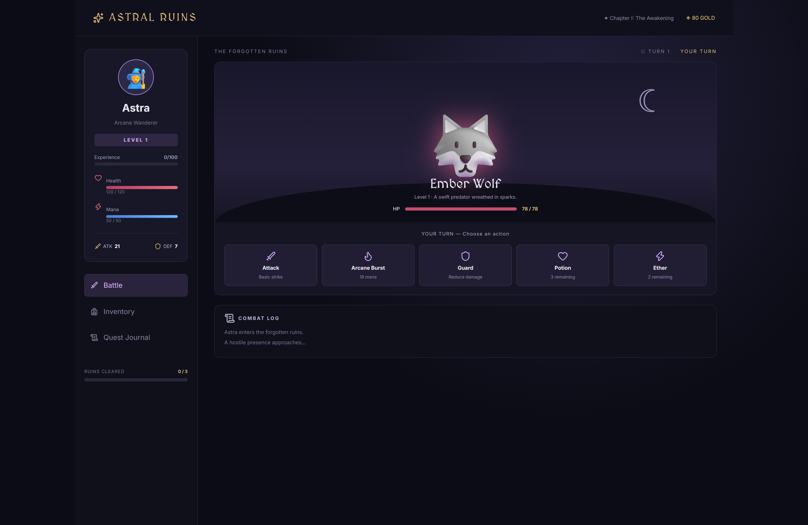

# ⚔️ Astral Ruins — Turn-Based RPG

A dark fantasy turn-based RPG built with React.js and Vite, featuring strategic combat, magical abilities, enemy progression, inventory management, and an immersive fantasy-themed interface.

Test your combat skills, defeat powerful enemies, gain experience, and save the realm from darkness.

---

## 🛠️ Technologies Used

* **Frontend:** React.js, Vite
* **Styling:** CSS3 (Custom Dark Fantasy Theme)
* **Tooling & Build:** Node.js, npm

---

## 📸 Screenshots

### Battle Arena


---

## 🎮 Features

* **Turn-Based Combat** — Strategically choose your actions during battles.
* **Multiple Combat Actions** — Attack, use Arcane Burst, Guard, heal, or restore mana.
* **Unique Enemies** — Battle progressively stronger fantasy creatures.
* **Experience & Leveling** — Earn XP, level up, and improve your character's attributes.
* **Inventory System** — Manage healing potions, ether, and gold.
* **Quest Journal** — Track your progress through the Forgotten Ruins.
* **Combat Log** — Review battle actions and events.
* **Victory & Defeat System** — Complete the adventure or try again after defeat.
* **Responsive UI** — Enjoy the game across desktop and smaller screens.
* **Dark Fantasy Design** — Immersive visuals inspired by classic RPG adventures.

---

## 🧙 Game Mechanics

### Player Actions

| Action | Description |
| :--- | :--- |
| ⚔️ **Attack** | Deal physical damage to enemies |
| 🔥 **Arcane Burst** | Deal powerful magical damage using mana |
| 🛡️ **Guard** | Reduce incoming enemy damage |
| ❤️ **Potion** | Restore health |
| ✨ **Ether** | Restore mana |

### Progression

1. Defeat enemies to earn XP and gold.
2. Level up to increase health, attack, and defense.
3. Face increasingly powerful opponents.
4. Defeat the final **Void Warden** to complete the adventure.

---

## 📂 Project Structure

```text
turn-based-rpg/
├── public/
├── src/
│   ├── main.jsx
│   └── styles.css
├── index.html
├── package.json
├── vite.config.js
└── README.md
```

---

## 🚀 Getting Started

### Prerequisites

Make sure you have the following installed:

- Node.js (v18 or later recommended)
- npm

### Installation

1. Clone the repository:

```
git clone https://github.com/YOUR_USERNAME/turn-based-rpg-vite.git
```

2. Navigate to the project directory:

```
cd turn-based-rpg-vite
```

3. Install dependencies:

```
npm install
```

4. Start the development server:

```
npm run dev
```

5. Open the local URL displayed in your terminal.

## 📦 Build for Production

```
npm run build
```

To preview the production build:

```
npm run preview
```

## 🎯 Future Improvements

- Add more playable characters
- Introduce character classes and skill trees
- Add equipment and weapon upgrades
- Implement save and load functionality
- Add sound effects and background music
- Introduce boss battle mechanics
- Add more locations and story chapters
- Add online leaderboards

## 👨‍💻 Author

**Ajinkya Dhatrak**

GitHub: ```https://github.com/ajinkya029```

This project is available for educational and personal use.

